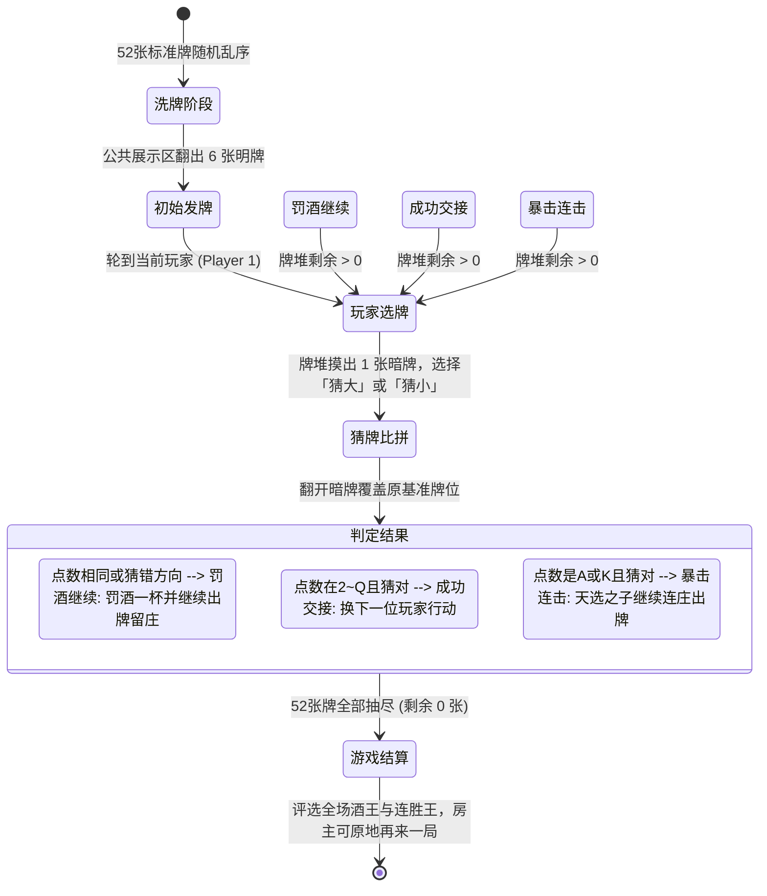

# 🍸 AfterParty 酒后派对 (微信小游戏合集平台)

> 专为酒吧、KTV、聚会轰趴量身打造的潮流破冰小游戏合集。基于 **Uni-app (Vue 3 + Vite + TypeScript)** 双端架构开发，后端采用 **Node.js 模块化独立微服务 + 统一 WebSocket 网关**，支持在未备案期间通过 H5 移动网页随点随玩，并可无缝发布为微信原生小程序。

---

## 📸 首发 MVP 核心玩法：猜扑克大小 (High / Low)



### 游戏规则要点
1. **牌数与洗牌**：标准扑克牌 52 张（不含大小王），开局伴随 3D 洗牌动画，公共区域随机发 6 张明牌，牌堆剩余 46 张。
2. **点数排序**：严格遵循 `A(1) < 2 < 3 < ... < 10 < J(11) < Q(12) < K(13)`，纯比点数不计花色。
3. **选牌与判定**：
   - 轮到的玩家从 6 张公共牌中自选 1 张作为对比标杆，牌堆摸出 1 张暗牌，玩家猜该暗牌比基准牌**更大**还是**更小**。
   - **平局即输**：若点数相同，判定输，罚酒一杯，翻开暗牌覆盖该公共牌位，**当前玩家继续留庄出牌**。
   - **猜错**：判定输，罚酒一杯，覆盖牌位，**当前玩家继续留庄出牌**。
   - **猜对且非 A/K**：顺利过关，覆盖牌位，交棒顺位下一位玩家。
   - **猜对且为 A 或 K**：触发**暴击连击（天选之子）**，覆盖牌位，**当前玩家继续留庄出牌**。
4. **全场结算**：抽完所有 52 张牌对局结束，展示整局酒王（罚酒最多者）及连胜统计，房主可一键重开。

---

## 🛠️ 项目工程结构

```
miniapp-afterparty/
├── docker-compose.yml              # OCI ARM 生产编排 (加入宿主机 app_infra-net)
├── .env.example                    # 环境变量配置模版
├── packages/
│   └── shared-types/               # 前后端共享数据模型、协议与状态定义
├── apps/
│   ├── client/                     # Uni-app 前端 (Vue 3 + Vite + TypeScript)
│   │   ├── src/
│   │   │   ├── pages/index/        # 首页游戏合集与身份设置
│   │   │   ├── pages/room/lobby    # 房间大厅、选座轮盘、6位房号与分享
│   │   │   ├── pages/game/highlow  # 3D 猜扑克大小赛博酒桌对决
│   │   │   ├── components/         # 3D 扑克组件 (PokerCard)、玩家席位 (SeatWheel)
│   │   │   ├── stores/             # Pinia 状态树 (User, Room, HighLow)
│   │   │   └── utils/socket.ts     # 跨端弹性重连 WebSocket 客户端
│   ├── gateway/                    # 统一 API 网关 & WebSocket 房间分发服务
│   │   ├── src/
│   │   │   ├── modules/auth/       # 微信授权 code2session 与游客身份签发
│   │   │   ├── modules/room/       # 6 位无冲突随机房号算法与席位调度
│   │   │   ├── db/                 # PostgreSQL 16 持久化连接池
│   │   │   └── ws/                 # 统一 WebSocket Hub (兼顾长连接与 H5 静态资源托管)
│   └── game-card-highlow/          # 独立小游戏微服务：猜扑克大小
│       ├── src/engine/             # 52张洗牌算法与比大小状态机
│       └── tests/                  # 100% 规则覆盖的 Vitest 单元测试
└── README.md
```

---

## 🚀 本地开发与调试

### 1. 安装依赖与启动服务
```bash
# 安装根工作区依赖
pnpm install

# 运行游戏规则单元测试
pnpm test

# 启动微服务与网关
pnpm dev:gateway
pnpm dev:game-highlow
```

### 2. 启动前端
```bash
# 启动 H5 网页端开发服务器 (默认端口 3000)
pnpm dev:client:h5

# 编译为微信小程序 (输出至 apps/client/dist/dev/mp-weixin)
pnpm dev:client:mp
```

---

## 🚢 OCI ARM 实例部署指南

### 1. Cloudflare DNS 解析
在 Cloudflare 控制台中添加一条 DNS A 记录：
- **Name**: `afterparty.miniapp`
- **IPv4 Address**: `163.192.63.236`
- **Proxy status**: Proxied 或 DNS-only 均可。

### 2. 宿主机 Caddyfile 追加反代配置
在宿主机 `/data/app/caddy/Caddyfile` 中追加以下规则：
```caddy
afterparty.miniapp.ashawk.online {
    reverse_proxy afterparty-gateway:4000
    encode gzip
}
```
热重载使配置生效：
```bash
docker exec caddy caddy validate --config /etc/caddy/Caddyfile
docker exec caddy caddy reload  --config /etc/caddy/Caddyfile
```

### 3. PostgreSQL 数据库初始化
进入宿主机现有 PostgreSQL 容器：
```bash
docker exec -it postgres psql -U hawk -d postgres
```
执行建库建用户命令：
```sql
CREATE DATABASE afterparty;
CREATE USER afterparty WITH PASSWORD 'your_secure_password';
GRANT ALL PRIVILEGES ON DATABASE afterparty TO afterparty;
```

### 4. 启动微服务容器
在 `/data/app/afterparty` 目录下创建 `.env` 文件（参考 `.env.example`），然后执行：
```bash
docker compose up -d --build
```
容器将自动加入宿主机的 `app_infra-net`，Caddy 即可无缝路由至 `afterparty-gateway:4000`。
