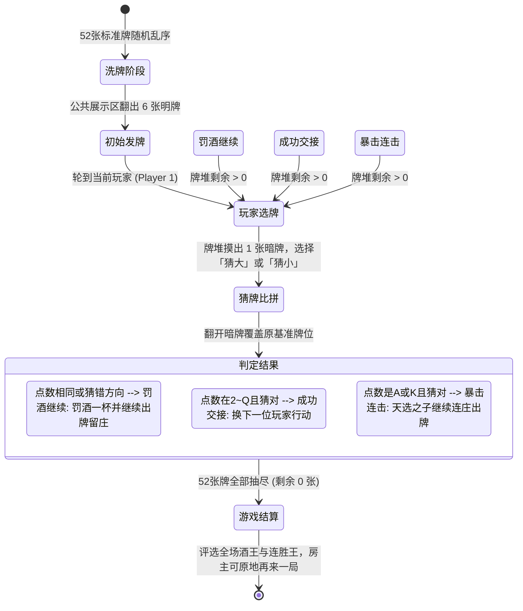

# 🍸 AfterParty 酒后派对 (微信小游戏合集平台)

> 专为酒吧、KTV、聚会轰趴量身打造的潮流破冰小游戏合集。基于 **Uni-app (Vue 3 + Vite + TypeScript)** 双端架构开发，后端采用 **Node.js 模块化独立微服务 + 统一 WebSocket 网关**，支持在未备案期间通过 H5 移动网页随点随玩，并可无缝发布为微信原生小程序。

---

## 📸 首发 MVP 核心玩法：猜扑克大小 (High / Low)



### 游戏规则要点
1. **牌数与洗牌**：标准扑克牌 52 张（不含大小王），开局伴随 3D 洗牌动画，公共区域随机发 6 张明牌，牌堆剩余 46 张。
2. **点数排序**：严格遵循 `A(1) < 2 < 3 < ... < 10 < J(11) < Q(12) < K(13)`，纯比点数不计花色。
3. **选牌与判定**：
   - 轮到的玩家从 6 张公共牌中自选 1 张作为对比标杆，牌堆摸出 1 张暗牌，玩家猜该暗牌比基准牌**更大**还是**更小**。
   - **平局即输**：若点数相同，判定输，罚酒一杯，翻开暗牌覆盖该公共牌位，**当前玩家继续留庄出牌**。
   - **猜错**：判定输，罚酒一杯，覆盖牌位，**当前玩家继续留庄出牌**。
   - **猜对且非 A/K**：顺利过关，覆盖牌位，交棒顺位下一位玩家。
   - **猜对且为 A 或 K**：触发**暴击连击（天选之子）**，覆盖牌位，**当前玩家继续留庄出牌**。
4. **全场结算**：抽完所有 52 张牌对局结束，展示整局酒王（罚酒最多者）及连胜统计，房主可一键重开。

---

## 🛠️ 项目工程结构

```
miniapp-afterparty/
├── docker-compose.yml              # OCI ARM 生产编排 (加入宿主机 app_infra-net)
├── .env.example                    # 环境变量配置模版
├── packages/
│   └── shared-types/               # 前后端共享数据模型、协议与状态定义
├── apps/
│   ├── client/                     # Uni-app 前端 (Vue 3 + Vite + TypeScript)
│   │   ├── src/
│   │   │   ├── pages/index/        # 首页游戏合集与身份设置
│   │   │   ├── pages/room/lobby    # 房间大厅、选座轮盘、6位房号与分享
│   │   │   ├── pages/game/highlow  # 3D 猜扑克大小赛博酒桌对决
│   │   │   ├── components/         # 3D 扑克组件 (PokerCard)、玩家席位 (SeatWheel)
│   │   │   ├── stores/             # Pinia 状态树 (User, Room, HighLow)
│   │   │   └── utils/socket.ts     # 跨端弹性重连 WebSocket 客户端
│   ├── gateway/                    # 统一 API 网关 & WebSocket 房间分发服务
│   │   ├── src/
│   │   │   ├── modules/auth/       # 微信授权 code2session 与游客身份签发
│   │   │   ├── modules/room/       # 6 位无冲突随机房号算法与席位调度
│   │   │   ├── db/                 # PostgreSQL 16 持久化连接池
│   │   │   └── ws/                 # 统一 WebSocket Hub (兼顾长连接与 H5 静态资源托管)
│   └── game-card-highlow/          # 独立小游戏微服务：猜扑克大小
│       ├── src/engine/             # 52张洗牌算法与比大小状态机
│       └── tests/                  # 100% 规则覆盖的 Vitest 单元测试
└── README.md
```

---

## 🚀 本地开发与调试

### 1. 安装依赖与启动服务
```bash
# 安装根工作区依赖
pnpm install

# 运行游戏规则单元测试
pnpm test

# 启动微服务与网关
pnpm dev:gateway
pnpm dev:game-highlow
```

### 2. 启动前端
```bash
# 启动 H5 网页端开发服务器 (默认端口 3000)
pnpm dev:client:h5

# 编译为微信小程序 (输出至 apps/client/dist/dev/mp-weixin)
pnpm dev:client:mp
```

---

## 🚢 生产部署与发布 SOP 标准操作指南

本系统采用 **后端微服务容器化 + 宿主机共享基础设施 (`app_infra-net`) + Caddy 反向代理 + 微信开发者工具原生打包** 的标准发布流水线。

---

### 第一阶段：OCI ARM 基础设施与微服务部署 (由 Hermes Agent 执行)

#### 1. 宿主机现有共享公共基础设施确认
在部署新服务前，必须先确认宿主机已有的共享组件：
- **公共网络**：`app_infra-net` (包含 postgres、redis、caddy 等公共容器)
- **公共凭据**：`/data/app/.env` (集中管理 `REDIS_PASSWORD`、`PG_PASSWORD` 等核心密码)
- **共享 Redis**：主机名 `redis`，端口 `6379`，密码复用自 `/data/app/.env`
- **共享 PostgreSQL**：主机名 `postgres`，端口 `5432`，为每个应用增量创建独立用户和数据库

#### 2. PostgreSQL 专属库初始化 (幂等脚本)
```bash
AP_DB_PASS=$(openssl rand -base64 16 | tr -dc 'a-zA-Z0-9' | head -c 16)

# 幂等建 role 与 db
docker exec -i postgres psql -U hawk -d postgres -tc \
  "SELECT 1 FROM pg_roles WHERE rolname='afterparty'" | grep -q 1 || \
docker exec -i postgres psql -U hawk -d postgres \
  -c "CREATE ROLE afterparty WITH LOGIN PASSWORD '${AP_DB_PASS}'"

docker exec -i postgres psql -U hawk -d postgres -tc \
  "SELECT 1 FROM pg_database WHERE datname='afterparty'" | grep -q 1 || \
docker exec -i postgres psql -U hawk -d postgres \
  -c "CREATE DATABASE afterparty OWNER afterparty"

# 带标准规范注释写入集中环境凭据
cat <<EOF >> /data/app/.env

# AFTERPARTY_DB_PASSWORD
# 名称: AfterParty 小程序后端数据库密码
# 创建: $(date +%Y-%m-%d)
# 有效期: 长期
# 关联: PG 角色 afterparty / 库 afterparty (postgres 容器)
# 权限: 仅 afterparty 库 CRUD
# 用途: /data/app/afterparty 服务连接
AFTERPARTY_DB_PASSWORD=${AP_DB_PASS}
EOF
```

#### 3. 拉取代码并生成应用专属 `.env`
```bash
mkdir -p /data/app && cd /data/app
if [ ! -d "/data/app/afterparty" ]; then
  git clone https://github.com/h382110229/miniapp-afterparty.git afterparty
else
  cd afterparty && git pull origin main
fi
cd /data/app/afterparty

# 读取公共 Redis 密码与刚生成的数据库密码
source /data/app/.env

cat <<EOF > .env
REDIS_PASSWORD=${REDIS_PASSWORD}
POSTGRES_DB=afterparty
POSTGRES_USER=afterparty
POSTGRES_PASSWORD=${AFTERPARTY_DB_PASSWORD}
JWT_SECRET=$(openssl rand -hex 24)
WX_APPID=wxdcb8e15f09e5f219
WX_APPSECRET=
EOF
chmod 600 .env
```

#### 4. 容器构建与健康检查
```bash
docker compose up -d --build
docker compose ps
curl -fsS http://127.0.0.1:4000/health
```

#### 5. Caddyfile 备份与反代热重载
```bash
# 变更铁律：先备份再修改
cp /data/app/caddy/Caddyfile /data/app/caddy/Caddyfile.bak.$(date +%Y%m%d%H%M%S)

if ! grep -q "afterparty.miniapp.hawkren.online" /data/app/caddy/Caddyfile; then
cat <<'EOF' >> /data/app/caddy/Caddyfile

afterparty.miniapp.hawkren.online {
    reverse_proxy afterparty-gateway:4000
    encode gzip
}
EOF
fi

docker exec caddy caddy validate --config /etc/caddy/Caddyfile
docker exec caddy caddy reload --config /etc/caddy/Caddyfile

# 公网验证
curl -fsS https://afterparty.miniapp.hawkren.online/health
```

---

### 第二阶段：微信小程序客户端构建与发布 (微信开发者工具)

#### 1. 本地生产构建
在本地项目根目录下执行：
```bash
pnpm --filter @afterparty/client build:mp-weixin
```
编译产物输出至：`apps/client/dist/build/mp-weixin`。

#### 2. 微信公众平台服务器域名白名单 (mp.weixin.qq.com)
确保【开发】->【开发管理】->【开发设置】已登记：
- `request合法域名`: `https://afterparty.miniapp.hawkren.online`
- `socket合法域名`: `wss://afterparty.miniapp.hawkren.online`

#### 3. 开发者工具上传与版本发布
1. 打开 **微信开发者工具**，导入项目目录 `apps/client/dist/build/mp-weixin`；
2. 点击右上角 **【上传】**，填写版本号与备注；
3. 打开手机 **“微信小程序助手”** -> **“版本管理”**，将该版本 **“选为体验版”**；
4. 好友扫码体验版二维码，即刻开始跨端联机对战！
